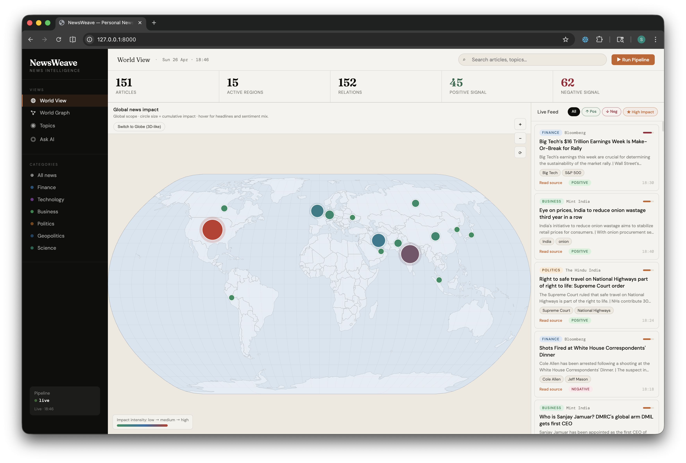
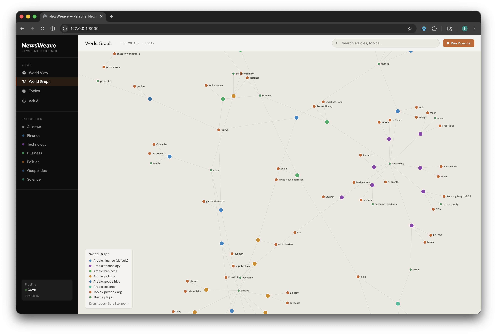
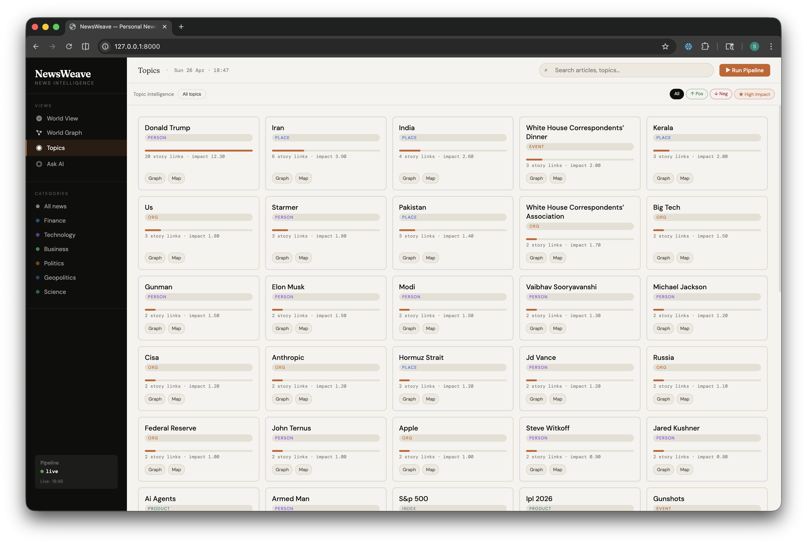
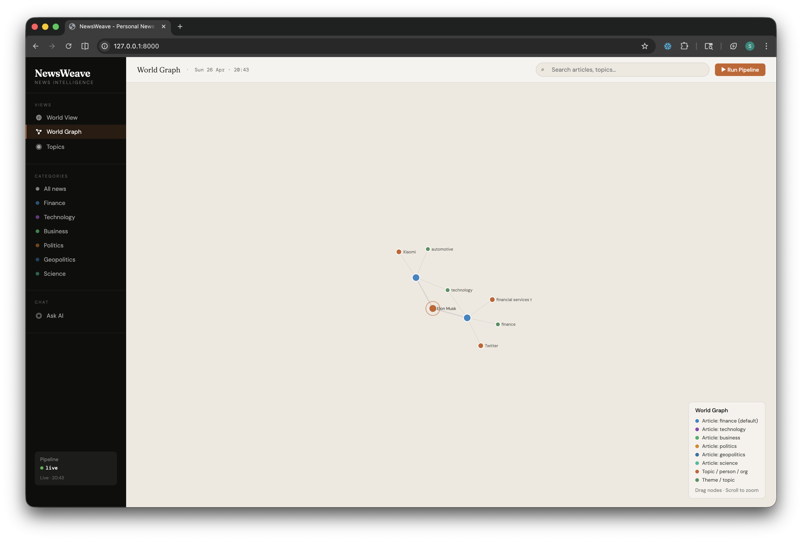
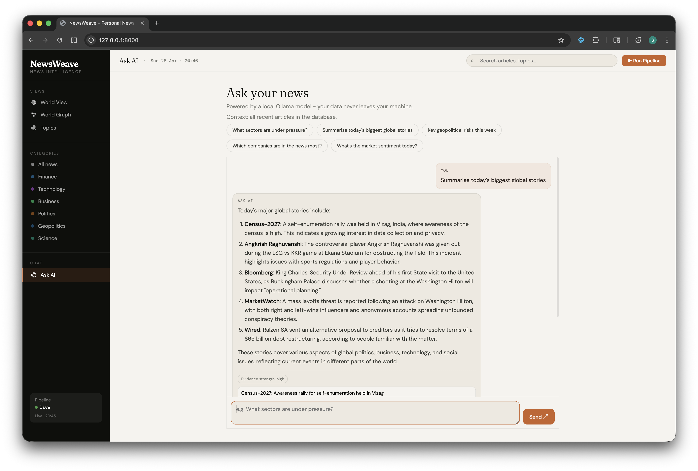

# NewsWeave

AI-powered geopolitical and market intelligence dashboard that turns global news into actionable topic graphs, risk alerts, and decision-ready briefs.

## What This Project Does

NewsWeave ingests curated RSS news feeds, enriches stories with LLM analysis, builds a knowledge graph, and serves a fullstack dashboard with:

- World impact view (country-level signal heat and trends)
- World graph view (article-topic-entity network)
- Topic intelligence view
- Ask AI chat (with confidence + source citations)
- Watchlists, alert evaluation, and brief generation APIs

## Architecture

- `news_agent.py`: async RSS ingestion and article normalization
- `analyst_agent.py`: LLM enrichment (entities/topics/sentiment/impact)
- `graph_agent.py`: NetworkX graph construction and D3 export
- `storage_agent.py`: SQLite persistence (articles, graph, watchlists, alerts)
- `orchestrator.py`: pipeline runner / scheduler loop
- `agentic_workflow.py`: LangGraph-based pipeline flow
- `api.py`: FastAPI backend + API routes + dashboard hosting
- `dashboard.html`: single-page frontend (D3 + chat + controls)

## Prerequisites

- Python 3.12+ (3.13 works as well)
- [uv](https://docs.astral.sh/uv/) for package and venv management
- [Ollama](https://ollama.com/) running locally (optional if using OpenAI)

## Setup (uv-based)

```bash
# Clone the repo
git clone git@github.com:skoli0/newsweave.git
# Change the working directory
cd newsweave

# from repo root
uv venv
source .venv/bin/activate

# install dependencies from requirements
uv pip install -r requirements.txt
```

### Optional model setup (local LLM)

```bash
ollama serve
ollama pull qwen2.5:0.5b
```

## Run Locally

### 1) Start API + dashboard

```bash
uv run uvicorn api:app --host 0.0.0.0 --port 8000 --reload
```

Open: `http://localhost:8000`

### 2) Run pipeline once (optional manual refresh)

```bash
uv run python orchestrator.py
```

### 3) Continuous pipeline mode

```bash
SCHEDULER_MODE=true uv run python orchestrator.py
```

## Environment Variables

Common variables:

- `OLLAMA_HOST` (default: `http://127.0.0.1:11434`)
- `OLLAMA_MODEL` (default: `qwen2.5:0.5b`)
- `MAX_ARTICLES` (default: `20`, demo-friendly)
- `RUN_INTERVAL_MINUTES` (default: `30`)
- `OPENAI_API_KEY` (optional; enables OpenAI path)
- `OPENAI_MODEL` (default: `gpt-4o-mini`)
- `OPENAI_BASE_URL` (default: `https://api.openai.com/v1`)
- `NEWSAPI_KEY` (optional)

Example:

```bash
export OLLAMA_MODEL=qwen2.5:0.5b
export MAX_ARTICLES=20
export OPENAI_API_KEY=...
```

## Container Usage

```bash
docker compose -f docker-compose.yml up --build
# or
podman compose -f docker-compose.yml up --build
```

Services include API, scheduler, and Ollama model bootstrap.

## API Overview

Core:

- `GET /api/health`
- `GET /api/articles`
- `GET /api/graph`
- `GET /api/world/impact`
- `GET /api/stats`
- `POST /api/run`
- `GET /api/pipeline/last`
- `POST /api/agent/run` (LangGraph flow)

AI and insights:

- `GET /api/ask` (returns answer, confidence, citations)
- `GET /api/brief`

Watchlists and alerts:

- `GET /api/watchlists`
- `POST /api/watchlists`
- `DELETE /api/watchlists/{watchlist_id}`
- `POST /api/watchlists/evaluate`
- `GET /api/alerts`
- `GET /api/scheduler/status`

## Screenshots

### 1) World View


### 2) World Graph


### 3) Topics Intelligence


### 4) Specific Topic Knowledge Graph


### 5) Ask AI


## Quick API Examples

```bash
curl "http://localhost:8000/api/articles?limit=20"
curl "http://localhost:8000/api/ask?q=What+is+driving+AI+policy+risk%3F"
curl -X POST "http://localhost:8000/api/watchlists?name=AI+Regulation&category=politics&query=ai&min_impact=0.75&min_articles=2"
curl "http://localhost:8000/api/brief?category=technology&limit=12"
```

## Data Storage

SQLite DB path:

- `data/newsweave.db`

Main tables:

- `articles`, `entities`, `edges`, `graph_d3`
- `watchlists`, `alerts`, `runs`

## Troubleshooting

- **Ollama not reachable**: ensure `ollama serve` is running and `OLLAMA_HOST` is correct.
- **No articles shown**: run `POST /api/run` or `python orchestrator.py` once.
- **OpenAI path failing**: validate `OPENAI_API_KEY` and model name.
- **Container build context too large**: `.containerignore` already excludes `.venv`, DB files, and `.env`.

## Security Notes

- Do not commit `.env` or real API keys.
- This repo is set up to use environment variables for secrets.
- Prefer local Ollama for privacy-first runs.

## Development Notes

- Keep `Dockerfile` and `Containerfile` in sync.
- `TUTORIAL.md` contains historical walkthrough content; `README.md` is the source of truth for current setup.

